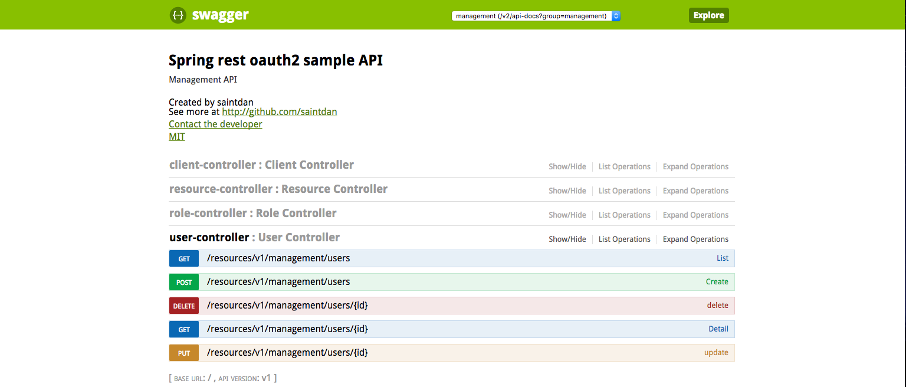
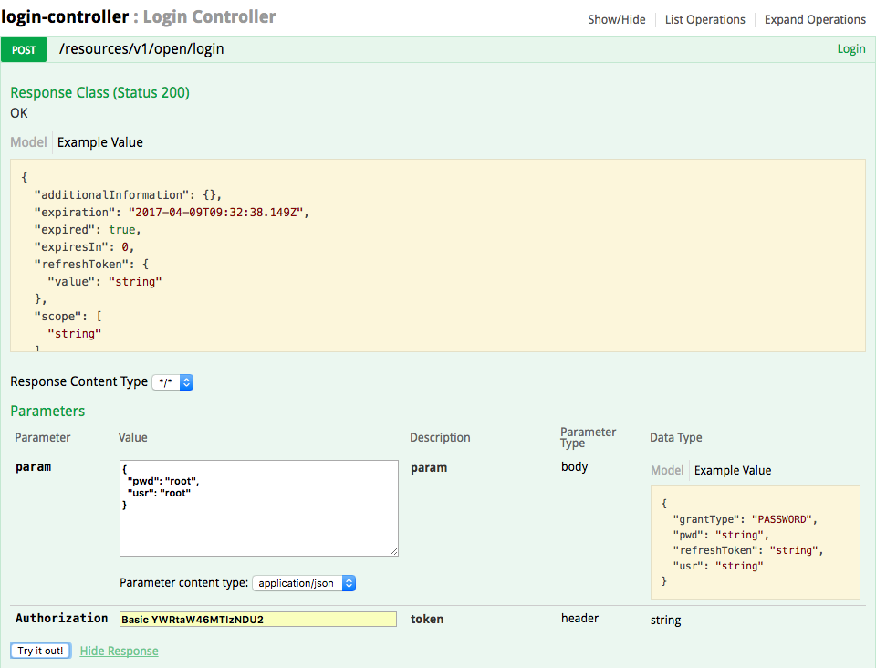
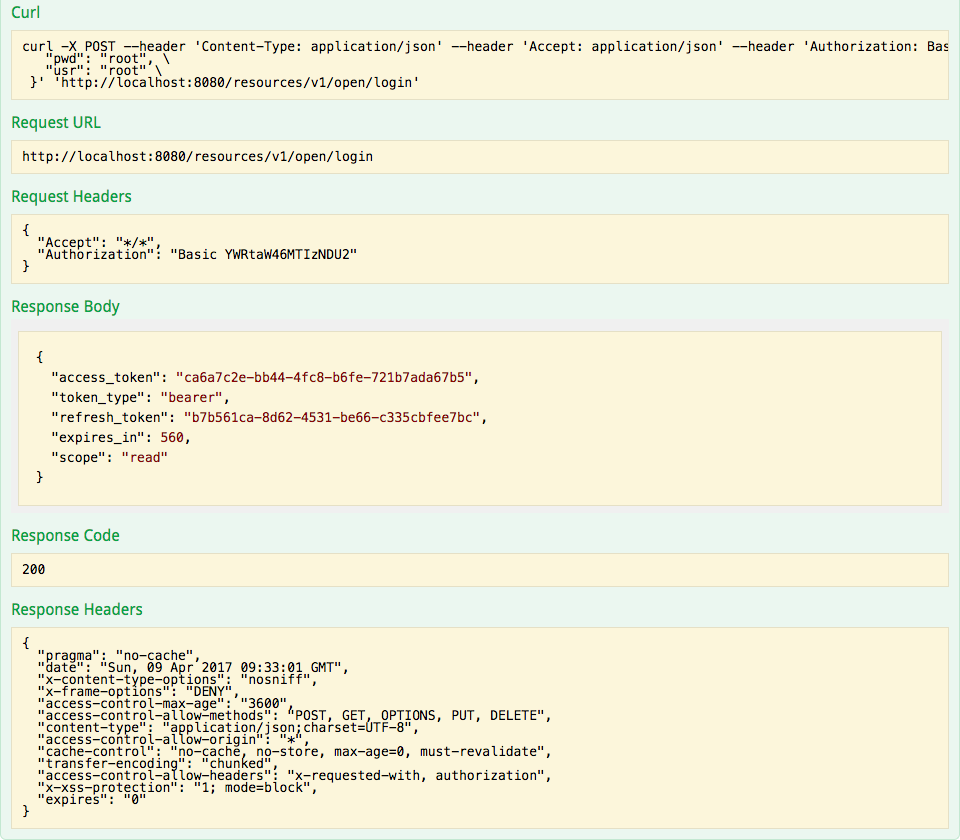
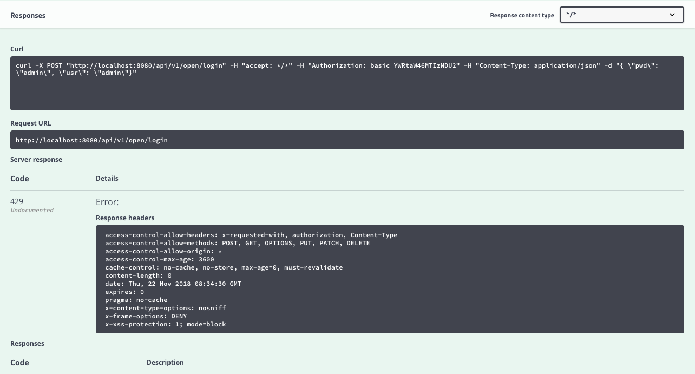
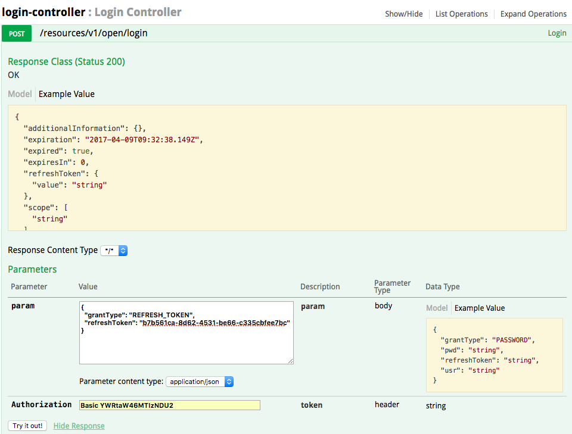
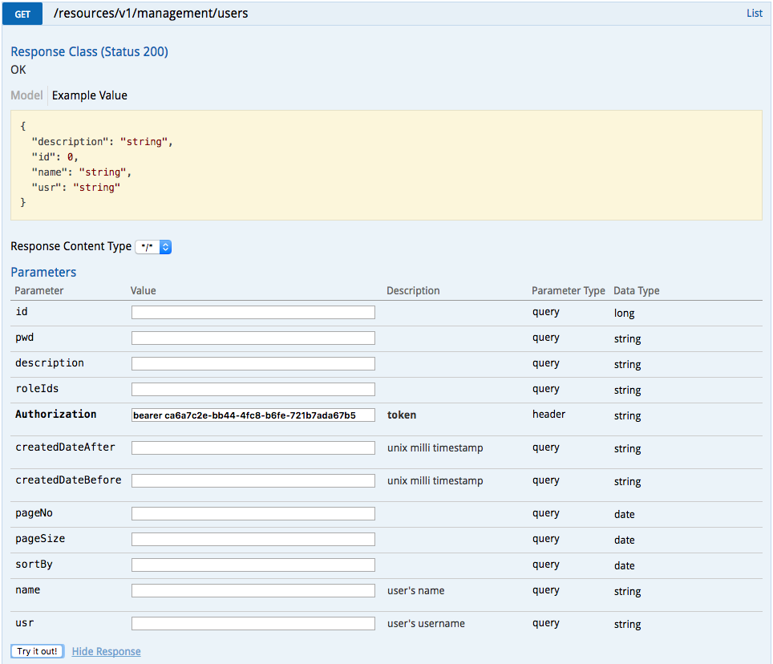
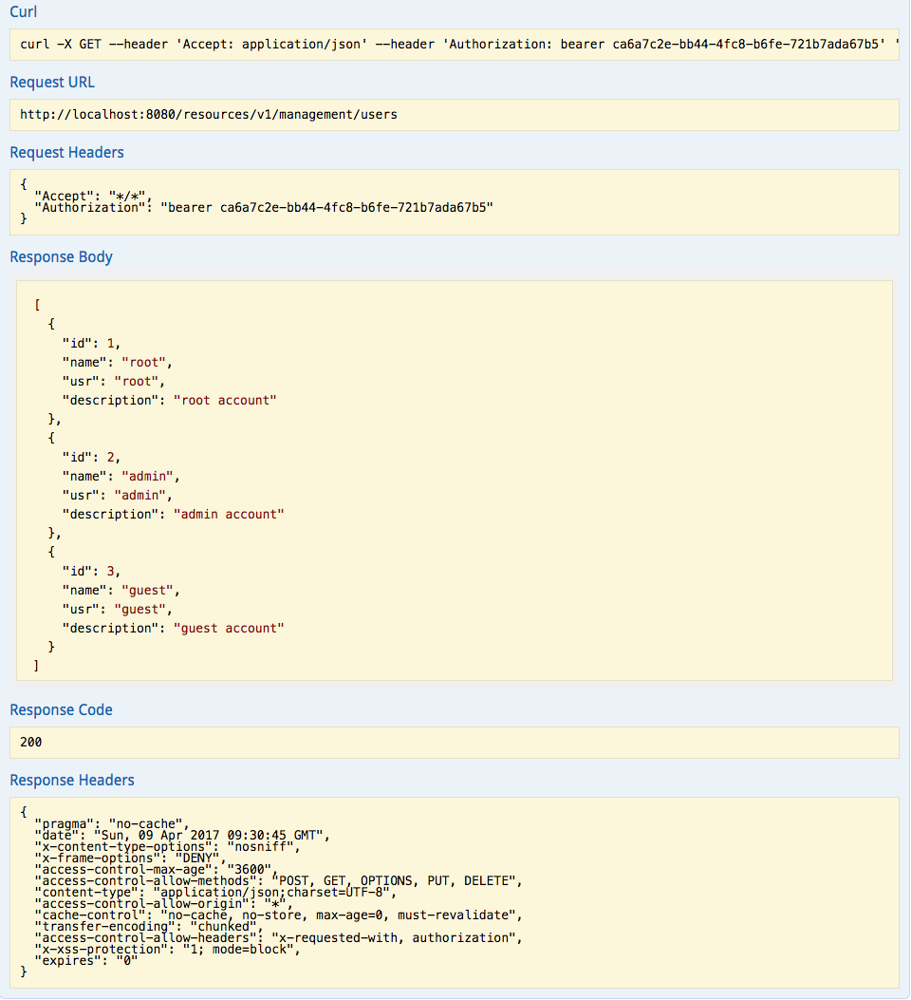

# spring-microservices-boilerplate

[English Version](README.md)

## <a name="index"></a>目录

- [编译运行](#build)
- [注意](#notice)
- [使用](#usage)
  - [导入init.sql](#init)
  - [使用 **Swagger** 文档访问资源](#swagger)
- [部署](#deploy)
- [许可证](#license)
- [版本信息](#version)

spring-microservices-boilerplate，是一个方便JAVA后端人员快速开发的微服务脚手架。对前端友好，适于前后端分离，敏捷开发模式。

**优点：**

 - 采用领域驱动模型结构定义package结构；
 - 微服务架构，更加灵活，降低开发及维护的复杂度；
 - 使用 OAuth2 作为授权验证；
 - 使用 json 方式请求数据；
 - 返回标准的 ResponseEntity，并按 HttpStatus 标准返回状态码；
 - 使用 [Gradle](https://gradle.org/) 作为项目构建工具；
 - 使用 [Swagger](http://swagger.io/) 作为文档工具，方便维护文档，同时可使用Swagger做简易的API测试；

本脚手架基于以下组件构建：

- [Spring Boot](http://projects.spring.io/spring-boot/)
- [Spring OAuth 2](http://projects.spring.io/spring-security-oauth/)
- [Spring Security](http://projects.spring.io/spring-security/)
- [Spring Data JPA](http://projects.spring.io/spring-data-jpa/)

并且使用 [specification-arg-resolver](https://github.com/tkaczmarzyk/specification-arg-resolver) 作为过滤器.（为了方便使用了java8的LocalDateTime，还补充了spec注解。）

> **NOTE**  
> 如果要使用RSA验签,请使用 [ValidateHelper](src/main/java/com/saintdan/framework/component/ValidateHelper.java) 的`validateWithSignCheck`方法，并在需要签名的字段上加上注解 [SignField](src/main/java/com/saintdan/framework/annotation/SignField.java) 。

## <a name="build"></a>编译运行 [[TOP]](#index)

Linux 及 Unix 使用以下命令。

```
$ cd <spring-microservices-boilerplate root path>
$ ./gradlew clean build bootRun
```

Windows 下，直接双击 gradlew.bat 运行。

## <a name="notice"></a>注意 [[TOP]](#index)

- Validate failed -> Response http status is **422**(Unprocessable Entity)
- Server error -> Response http status is **500**(Internal Server Error)

## <a name="usage"></a>使用 [[TOP]](#index)

### <a name="init">导入[init.sql](src/main/resources/init.sql)到您的数据库，建议使用 [PostgreSQL](https://www.postgresql.org/) [[TOP]](#index)

### <a name="swagger"></a>使用 Swagger 文档访问资源 [[TOP]](#index)

启动项目，在浏览器（程序员当然用Chrome咯 ;) ）中访问 [http://localhost:8080/swagger-ui.html#/](http://localhost:8080/swagger-ui.html#/)（默认端口8080，您可以修改 [application.yml](src/main/resources/application.yml) 中的 `server.port` 来修改端口。）

出现如下页面



然后根据文档提示即可测试各接口。

1. 从 open 组的 login 接口获取登录 token 和刷新 token。

得到结果


如果给 "Limit-Key" header 添加一个值，比如 "root", 当你频繁请求这个 API 时，便会返回 429 错误响应。


得到结果:


2. 或者使用 refresh token 来获取新的token。


3. 用得到的 access_token 来访问资源

得到结果


### <a name="deploy"></a>部署 [[TOP]](#index)

1. 传统，打个 war 包丢 tomcat 里
2. 高效，打成 jar 包直接通过 `java -jar foo.jar` 运行
3. 高效独立干净，使用 Docker.[Dockerfile](Dockerfile) 已写好，按您的需要做修改即可 build Docker 镜像。

此外，[docker-compose.yml](docker-compose.yml) 也已写好，方便您快速一键部署 Docker 容器。
> **NOTE**  
> 现使用了 docker-compose3 的新特性，需要您的 docker 版本高于1.13.0

## <a name="license"></a>许可证 [[TOP]](#index)

**[MIT](http://opensource.org/licenses/MIT)**

Copyright (c) since 2015 saintdan

## <a name="version"></a>Version History [[TOP]](#index)

[查看版本信息点我哟～ ;)](VERSION_HISTORY.md)